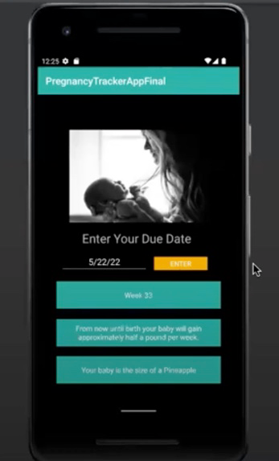
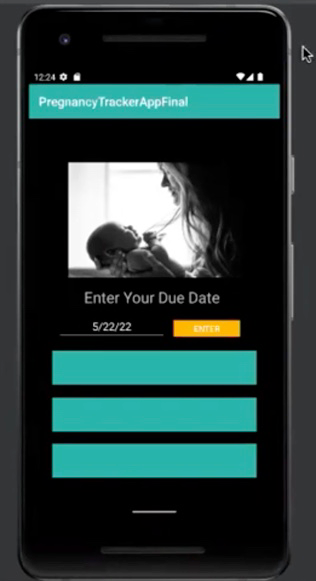

# Overview

This app is my way of improving my app design and Kotlin programming skills.

Tailored exclusively for pregnant women, this app transcends conventional utility. Its primary aim is to empower expectant mothers by offering an intuitive solution to effortlessly monitor and cherish their pregnancy journey.

The app simplifies the process of tracking pregnancy progress by entering the due date.

More than just a tracker, the app enriches the experience by providing users with captivating developmental facts about their baby. This personalized touch adds an extra layer of connection, turning each interaction into a moment of shared discovery.

To make the experience even more memorable, the app creatively compares the baby's size to various fruits corresponding to the current week of pregnancy. This visual representation adds a delightful dimension to the journey, making it not only informative but visually engaging.

# Development Environment

Android Studio Code with a Android API 32 Google Play Emulator

The programming language used is Kotlin.  It is run using the java.time.LocalDate library to be able to use dates and the java.time.temporal.ChronoUnit library which allows the program to run a function to find the number of days between two dates.

# Useful Websites

* [kotlinlang.org]( https://kotlinlang.org/docs/functions.html)
* [programiz.com]( https://www.programiz.com/kotlin-programming/if-expression)
